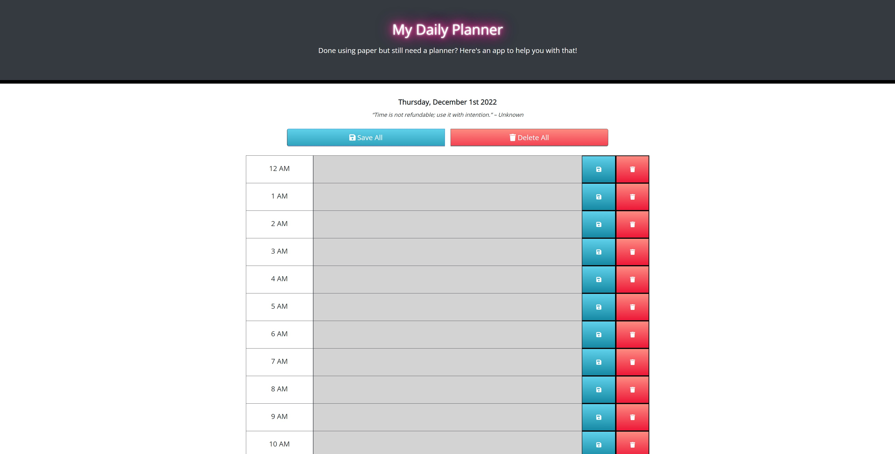
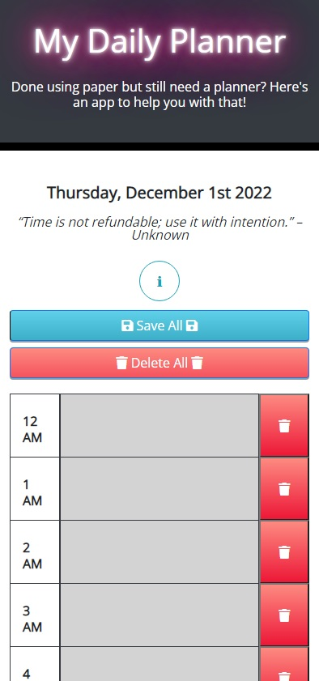

# :clipboard: :watch: :date: My Daily Planner :date: :watch: :clipboard:  

### Done using paper but still need a planner? Here's an app to help you with that!  

:computer: **Live Deployment:** https://jwilferd10.github.io/My-Daily-Planner/

:computer: **Github Repository:** https://github.com/jwilferd10/My-Daily-Planner

## :open_file_folder: Table of Contents:
  - [Preview](#camera-preview)
  - [Demo](#movie_camera-demo)
  - [Description](#wave-description)
  - [User Story](#book-user-story)
  - [Resources Used](#floppy_disk-resources-used)
  - [Installation](#minidisc-installation-and-usage)
  - [Contact Information](#e-mail-contact-information)

## :camera: Preview:

  
  

## :movie_camera: Demo:

## :wave: Description: 

 
Have you ever wanted an app that helps you to plan your entire day out, hour by hour? Welcome to My Daily Planner, it's here to help you with that! My Daily Planner is a :two::four: - hour time scheduling application that saves user input to localStorage.

My Daily Planner utilizes jQuery for it's quick and easy setup and moment.JS to present the current date and help color code each time block based on the time of day:

:arrow_forward: :green_circle: Indicates the time left in the day 

:arrow_forward: :red_circle: Indicates current date 

:arrow_forward: :white_circle: Indicates that the time has passed

Users can save each entry to localStorage individually or altogether based on the type of save button clicked. This is likewise for deleting entries, however if the 'Delete All' button is engaged users will be prompted with a modal to confirm their decision. 

It's my hope that My Daily Planner helps YOU out anyway possible, happy coding!

  
## :book: User Story:
**AS AN employee with a busy schedule**
- I WANT to add important events to a daily planner
- SO THAT I can manage my time effectively

**GIVEN user is using daily planner to create a schedule**
- When user opens the planner 
  - current day is displayed at the top 
- When user scrolls down,
  - They're presented with time blocks using standard business hours
- When user view the time blocks for that day 
  - Each time block is color coded indicating past, present, and future
- When user clicks onto a time block 
  - They can enter an event

## :floppy_disk: Resources Used:
Main Resources:
- HTML
- CSS
- Bootstrap
- JavaScript
- jQuery
- Moment.js

## :minidisc: Installation and Usage:
### Install:
- You can do this by clicking the *GREEN* button above and you can download it by ZIP or copy the SSH!
### Usage:
- Click on the text area within the time block
- Fill out your entry
- Click on the button with the 💾 floppy disk 💾 emoji (The :large_blue_circle: Button) to save the entry
- Click on the button with the 🗑️ trash can 🗑️ (The :red_circle: Button) to delete the entry
- Click 'Save All' to save all entries within each time block
- Click on Delete All button to delete all entries

## :e-mail: Contact Information:
- ### [jwilferd10](https://github.com/jwilferd10)
